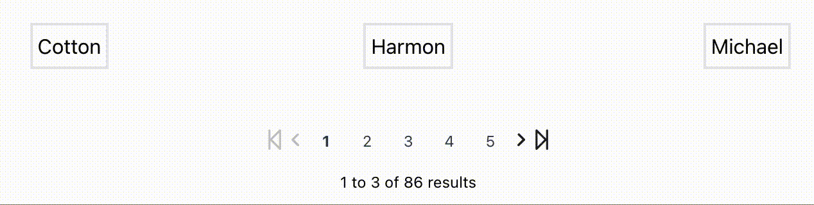

## Paginator Demo 

A customizable pagination interface, suitable for web applications requiring dynamic data display. You can see how the Paginator allows users to navigate through a dataset.


## Getting Started

### Prerequisites
Make sure you have Node.js and npm installed:
- [Download Node.js and npm](https://nodejs.org/en/download/)

### Installation
Clone this repository and install dependencies:
   ```
     git clone https://github.com/Dan-Wong56004/react-pagination.git
     npm install
   ```

###  Contributing
Contributions are welcome! Please feel free to submit pull requests or open issues to suggest improvements or add new features.

